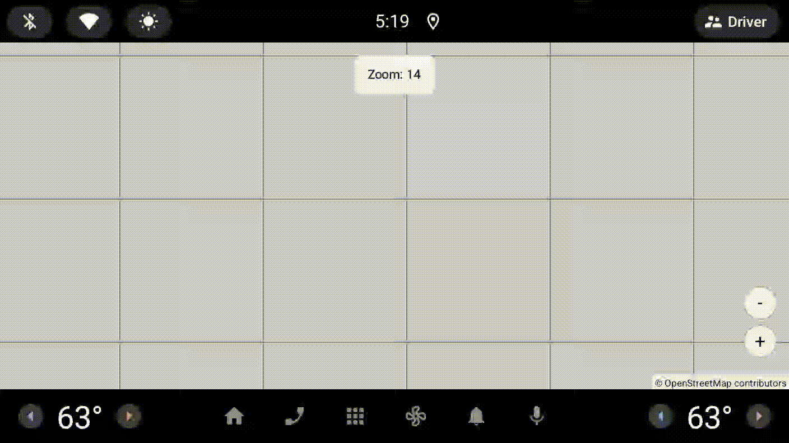

[](https://github.com/afarber/OpenMapView/actions/workflows/ci.yml)
[](https://github.com/afarber/OpenMapView/actions/workflows/daily.yml)
[](https://github.com/afarber/OpenMapView/actions/workflows/release.yml)
[](https://codecov.io/gh/afarber/OpenMapView)
[](https://central.sonatype.com/artifact/de.afarber/openmapview)
[](https://jitpack.io/#afarber/OpenMapView)

# OpenMapView

A modern, Kotlin-first MapView replacement for Android — powered by [OpenStreetMap](https://www.openstreetmap.org/).

## Installation

### Maven Central (Recommended)

Add the dependency to the module `build.gradle.kts`:

```kotlin
dependencies {
    implementation("de.afarber:openmapview:0.1.0")
}
```

Or for Groovy `build.gradle`:

```groovy
dependencies {
    implementation 'de.afarber:openmapview:0.1.0'
}
```

### JitPack (Alternative)

JitPack provides instant access to GitHub releases and supports development snapshots.

Add the JitPack repository in `settings.gradle.kts`:

```kotlin
dependencyResolutionManagement {
    repositories {
        google()
        mavenCentral()
        maven { url = uri("https://jitpack.io") }
    }
}
```

Then add the dependency:

```kotlin
dependencies {
    implementation("com.github.afarber:OpenMapView:0.1.0")
}
```

For Groovy `settings.gradle`:

```groovy
dependencyResolutionManagement {
    repositories {
        google()
        mavenCentral()
        maven { url 'https://jitpack.io' }
    }
}
```

```groovy
dependencies {
    implementation 'com.github.afarber:OpenMapView:0.1.0'
}
```

## Features

- Drop-in compatible with Google `MapView` (non-deprecated methods only)
- Lightweight, pure Kotlin implementation
- OSM tiles via standard APIs
- Extensible marker, overlay, and gesture handling
- MIT licensed (use freely in commercial apps)

## Examples

Explore the example applications to see OpenMapView in action:

### [Example01Pan](examples/Example01Pan) - Basic Map Panning


Demonstrates basic map tile rendering and touch pan gestures.

### [Example02Zoom](examples/Example02Zoom) - Zoom Controls and Gestures



Shows zoom functionality with FAB controls and pinch-to-zoom gestures.

### [Example03Markers](examples/Example03Markers) - Marker Overlays


Demonstrates marker system with custom icons and click handling.

### [Example04Polylines](examples/Example04Polylines) - Polylines and Polygons


Shows how to draw vector shapes including polylines, filled polygons, and polygons with holes.

## Documentation

- [Contributing Guide](docs/CONTRIBUTING.md) - Code quality requirements, formatting, git hooks, and PR process
- [Lifecycle Management](docs/LIFECYCLE.md) - How OpenMapView handles Android lifecycle events
- [Publishing Guide](docs/PUBLISHING.md) - Publishing to Maven Central and JitPack
- [GitHub Workflows](docs/GITHUB_WORKFLOWS.md) - CI/CD pipeline and workflow architecture
- [Unit Testing](docs/TESTING_UNIT.md) - JVM unit tests with Robolectric for Android framework APIs
- [Instrumented Testing](docs/TESTING_INSTRUMENTED.md) - On-device (phone and auto) testing with Android emulator

## Getting Started

### With Jetpack Compose

```kotlin
@Composable
fun MapViewScreen() {
    val lifecycleOwner = androidx.lifecycle.compose.LocalLifecycleOwner.current

    AndroidView(
        factory = { context ->
            OpenMapView(context).apply {
                // Register lifecycle observer for proper cleanup
                lifecycleOwner.lifecycle.addObserver(this)

                setCenter(LatLng(51.4661, 7.2491))
                setZoom(14.0)

                // Add markers (optional)
                addMarker(Marker(
                    position = LatLng(51.4661, 7.2491),
                    title = "Bochum City Center"
                ))
            }
        },
        modifier = Modifier.fillMaxSize()
    )
}
```

### With XML Layouts

```kotlin
class MainActivity : AppCompatActivity() {
    override fun onCreate(savedInstanceState: Bundle?) {
        super.onCreate(savedInstanceState)
        setContentView(R.layout.activity_main)

        val mapView = findViewById<OpenMapView>(R.id.mapView)
        mapView.setZoom(14.0)
        mapView.setCenter(LatLng(51.4661, 7.2491))
    }
}
```
