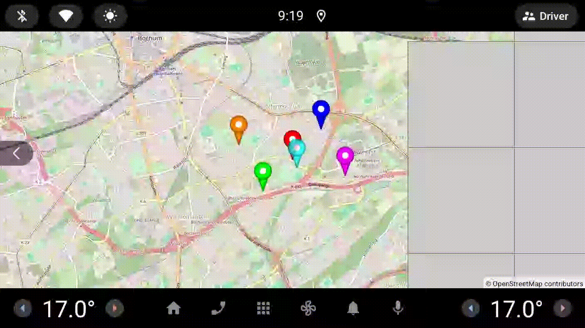

# Example03Markers - Marker Navigation and Info Windows

[Back to README](../../README.md)

This example demonstrates the marker system in OpenMapView, including marker rendering, touch detection, info windows, and marker navigation.

## Features Demonstrated

- Multiple markers at real Bochum landmark locations
- Default teardrop marker icons with color variations
- Marker click detection and selection tracking
- Info windows showing marker titles and snippets with auto-dismiss
- Navigation between markers with prev/next buttons
- Info window toggle via FAB or marker tap
- Real-time status display (selection index, camera state)
- Visual feedback when info window is shown (red text)

## Screenshot



## Quick Start

### Option 1: Run in Android Studio

1. Open the OpenMapView project in Android Studio
2. Select `examples.Example03Markers` from the run configuration dropdown
3. Click Run (green play button)
4. Deploy to your device or emulator

### Option 2: Build and Install from Command Line

```bash
# From project root - build, install, and launch
./gradlew :examples:Example03Markers:installDebug

# Launch the app
adb shell am start -n de.afarber.openmapview.example03markers/.MainActivity
```

## Project Structure

```
example03markers/
├── MainActivity.kt      # Main activity and MapViewScreen composable
├── MarkerToolbar.kt     # Horizontal toolbar with prev/next navigation buttons
├── StatusToolbar.kt     # Status overlay showing selection index and camera state
├── MarkerData.kt        # Marker data class and Bochum POI locations
└── Constants.kt         # Colors, dimensions, and durations
```

## Code Highlights

### MainActivity.kt

```kotlin
@Composable
fun MapViewScreen() {
    val lifecycleOwner = LocalLifecycleOwner.current
    var mapView: OpenMapView? by remember { mutableStateOf(null) }
    var selectedIndex by remember { mutableIntStateOf(0) }
    var selectedMarker: Marker? by remember { mutableStateOf(null) }
    var isInfoWindowShown by remember { mutableStateOf(false) }

    Box(modifier = Modifier.fillMaxSize()) {
        AndroidView(
            factory = { ctx ->
                OpenMapView(ctx).apply {
                    lifecycleOwner.lifecycle.addObserver(this)
                    setCenter(initialLocation)
                    setZoom(13.0f)
                    getUiSettings().infoWindowAutoDismiss = 10.seconds

                    setOnMarkerClickListener { marker ->
                        selectedMarker = marker
                        isInfoWindowShown = marker.isInfoWindowShown
                        true
                    }
                    setOnInfoWindowCloseListener {
                        isInfoWindowShown = false
                    }
                    mapView = this
                }
            },
            modifier = Modifier.fillMaxSize(),
        )

        StatusToolbar(selectedIndex, selectedMarker?.title, cameraState, isInfoWindowShown, ...)
        MarkerToolbar(onPrevClick = { ... }, onNextClick = { ... })
    }
}
```

### Adding Markers - Kotlin Style

```kotlin
addMarker(
    Marker(
        position = LatLng(51.4783, 7.2231),
        title = "Bochum Hauptbahnhof",
        snippet = "Main railway station",
        icon = BitmapDescriptorFactory.defaultMarker(BitmapDescriptorFactory.HUE_RED),
    )
)
```

### Adding Markers - Google Maps Style

```kotlin
addMarker(
    MarkerOptions()
        .position(LatLng(51.4650, 7.2500))
        .title("Builder Pattern")
        .snippet("Created with MarkerOptions")
        .alpha(0.8f)
)
```

### OSM-Inspired Colors (Constants.kt)

```kotlin
val OsmParkGreen = Color(0xFFAAD3A2)   // Navigation buttons (prev/next)
val OsmHighwayPink = Color(0xFFE892A2)  // Info window toggle FAB
val OsmWaterBlue = Color(0xFFAAD3DF)    // Reserved for future use
```

### Key Concepts

- **Marker**: Data class with position, title, snippet, icon, anchor, and tag
- **addMarker()**: Add a marker to the map
- **getMarkers()**: Get list of all markers
- **setOnMarkerClickListener()**: Handle marker click events
- **setOnInfoWindowClickListener()**: Handle info window click events
- **setOnInfoWindowCloseListener()**: Handle info window close events (manual or auto-dismiss)
- **infoWindowAutoDismiss**: Auto-dismiss info windows after a duration

## What to Test

1. **Launch the app** - you should see 6 colored markers at Bochum landmarks
2. **Tap a marker** - info window shows title and snippet, status text turns red
3. **Tap the same marker again** - info window closes, status text turns black
4. **Tap info window** - toast message confirms the click
5. **Tap prev/next buttons** - navigate between markers with camera animation
6. **Tap the FAB** - toggles info window on selected marker
7. **Wait 10 seconds** - info window auto-dismisses, status text turns black
8. **Pan/zoom the map** - markers stay at correct geographic positions

## Marker Locations

This example displays 6 markers at notable Bochum landmarks:

| Location          | Coordinates         | Description          |
| ----------------- | ------------------- | -------------------- |
| Hauptbahnhof      | 51.4783°N, 7.2231°E | Main railway station |
| Ruhr University   | 51.4452°N, 7.2622°E | Ruhr-Universitat     |
| Rathaus           | 51.4816°N, 7.2166°E | City Hall            |
| Bermuda3eck       | 51.4807°N, 7.2222°E | Entertainment dist.  |
| Bergbau-Museum    | 51.4892°N, 7.2174°E | Mining Museum        |
| Starlight Express | 51.4649°N, 7.2043°E | Musical theater      |

## Custom Marker Icons

To use custom marker icons instead of the default teardrop:

```kotlin
// Create custom bitmap (e.g., from resources)
val customIcon = BitmapFactory.decodeResource(
    resources,
    R.drawable.my_custom_marker
)

// Add marker with custom icon
addMarker(
    Marker(
        position = LatLng(51.4661, 7.2491),
        title = "Custom Marker",
        icon = customIcon,
        anchor = Pair(0.5f, 1.0f) // Center-bottom anchor
    )
)
```

## Technical Details

### Marker Anchor Point

The anchor determines which point of the icon aligns with the geographic position:

- `Pair(0.5f, 1.0f)` - Center horizontally, bottom vertically (default for pins)
- `Pair(0.5f, 0.5f)` - Center of icon
- `Pair(0.0f, 0.0f)` - Top-left corner

### Marker Rendering

Markers are drawn:

1. On top of map tiles (layered correctly)
2. In the order they were added (first added = bottom layer)
3. With proper screen-to-geographic coordinate conversion
4. Using the Web Mercator projection

### Touch Detection

Click detection uses:

- Bounding box hit testing on marker icons
- Reverse z-order checking (top markers checked first)
- Configurable movement threshold (10px) to distinguish clicks from drags

## Map Location

**Default Center:** Calculated from marker positions (~51.47°N, 7.22°E) at zoom 13.0

All 6 markers are positioned around Bochum at real landmark locations.
