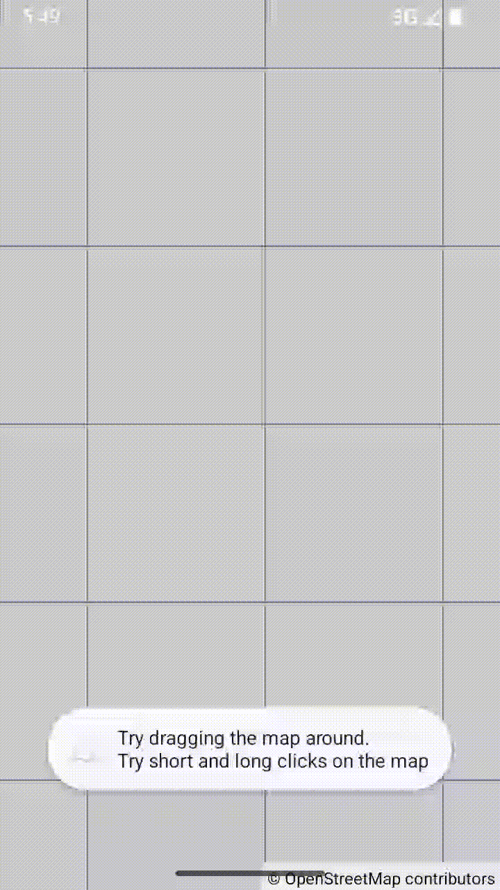

# Example06Clicks - Map Click Listeners

[Back to README](../../README.md)

This example demonstrates map click and long-click event handling in OpenMapView, showing how to detect user taps on the map and convert screen coordinates to geographic coordinates.

## Features Demonstrated

- Map click listener (single tap)
- Map long-click listener (tap and hold)
- Screen coordinate to LatLng conversion
- Real-time coordinate display via Toast messages
- Lifecycle-safe event handling

## Screenshot



## Quick Start

### Option 1: Run in Android Studio

1. Open the OpenMapView project in Android Studio
2. Select `examples.Example06Clicks` from the run configuration dropdown
3. Click Run (green play button)
4. Deploy to device or emulator

### Option 2: Build and Install from Command Line

```bash
# From project root - build, install, and launch
./gradlew :examples:Example06Clicks:installDebug

# Launch the app
adb shell am start -n de.afarber.openmapview.example06clicks/.MainActivity
```

## Code Highlights

### Setting Up Click Listeners

```kotlin
// Single tap listener
mapView.setOnMapClickListener { latLng ->
    Toast.makeText(
        this,
        "Clicked: ${latLng.latitude}, ${latLng.longitude}",
        Toast.LENGTH_SHORT
    ).show()
}

// Long-press listener
mapView.setOnMapLongClickListener { latLng ->
    Toast.makeText(
        this,
        "Long-clicked: ${latLng.latitude}, ${latLng.longitude}",
        Toast.LENGTH_LONG
    ).show()
}
```

### Coordinate Conversion

```kotlin
// Convert screen pixels to geographic coordinates
val latLng = mapView.screenToLatLng(screenX, screenY)
```

## Key Concepts

### OnMapClickListener

Functional interface for single tap events:

```kotlin
fun interface OnMapClickListener {
    fun onMapClick(latLng: LatLng)
}
```

- Triggered on single tap
- Receives LatLng of tapped location
- Does not interfere with pan gestures

### OnMapLongClickListener

Functional interface for long-press events:

```kotlin
fun interface OnMapLongClickListener {
    fun onMapLongClick(latLng: LatLng)
}
```

- Triggered after ~500ms press
- Receives LatLng of pressed location
- Uses Android GestureDetector for reliable detection

### Screen to Geographic Conversion

The library automatically converts screen coordinates to geographic coordinates using Web Mercator projection:

```kotlin
// Internal implementation in MapController
fun screenToLatLng(screenX: Float, screenY: Float): LatLng {
    val worldX = (screenX - (viewportWidth / 2f)) / scale + centerWorldX
    val worldY = (screenY - (viewportHeight / 2f)) / scale + centerWorldY

    return LatLng(
        latitude = worldYToLat(worldY),
        longitude = worldXToLon(worldX)
    )
}
```

## What to Test

1. Single Tap - Tap anywhere on the map to see coordinates in a short toast
2. Long Press - Press and hold to see coordinates in a longer toast
3. Zoom Interaction - Clicks work at any zoom level
4. Pan Interaction - Panning does not trigger click events
5. Toast Messages - Coordinates are displayed with full precision
6. Lifecycle - Listeners are cleaned up on activity destroy

## Touch Event Priority

OpenMapView handles touch events in this order:

1. Scale gestures (pinch-to-zoom)
2. Long-press detection
3. Single tap detection
4. Pan gestures

This ensures zoom and long-press have priority over panning.

## Technical Details

### GestureDetector Integration

The library uses Android's GestureDetector for reliable touch event handling:

- `onSingleTapConfirmed()` - Fires click listener after confirming single tap
- `onLongPress()` - Fires long-click listener after 500ms press
- Automatically distinguishes between tap, long-press, and pan gestures

### Coordinate Precision

LatLng coordinates are returned as Double values with full precision:

```kotlin
LatLng(
    latitude = 51.466123456789,
    longitude = 7.249087654321
)
```

This precision is suitable for:
- Adding markers at tapped locations
- Measuring distances between points
- Geocoding and reverse geocoding
- Route planning

### Performance

- Touch event processing is highly optimized
- Coordinate conversion uses efficient Web Mercator formulas
- No performance impact on map rendering
- Listeners are called on the UI thread

## Advanced Usage

### Adding Markers on Tap

```kotlin
mapView.setOnMapClickListener { latLng ->
    mapView.addMarker(Marker(
        position = latLng,
        title = "Tapped Location"
    ))
}
```

### Measuring Distance Between Points

```kotlin
var firstPoint: LatLng? = null

mapView.setOnMapClickListener { latLng ->
    val first = firstPoint
    if (first == null) {
        firstPoint = latLng
        Toast.makeText(this, "Tap second point", Toast.LENGTH_SHORT).show()
    } else {
        val distance = calculateDistance(first, latLng)
        Toast.makeText(
            this,
            "Distance: ${distance}m",
            Toast.LENGTH_LONG
        ).show()
        firstPoint = null
    }
}
```

### Context Menu on Long Press

```kotlin
mapView.setOnMapLongClickListener { latLng ->
    AlertDialog.Builder(this)
        .setTitle("Map Actions")
        .setItems(arrayOf("Add Marker", "Share Location", "Navigate")) { _, which ->
            when (which) {
                0 -> addMarkerAt(latLng)
                1 -> shareLocation(latLng)
                2 -> startNavigation(latLng)
            }
        }
        .show()
}
```

### Combining with Marker Click Listeners

```kotlin
// Map click listener
mapView.setOnMapClickListener { latLng ->
    Toast.makeText(this, "Map clicked", Toast.LENGTH_SHORT).show()
}

// Marker click listener
mapView.setOnMarkerClickListener { marker ->
    Toast.makeText(this, "Marker: ${marker.title}", Toast.LENGTH_SHORT).show()
    true // Return true to consume the event
}
```

When a marker is clicked:
- If marker listener returns `true`, event is consumed (map click not fired)
- If marker listener returns `false`, event propagates to map click listener

## Map Location

Default Center: Bochum, Germany (51.4620°N, 7.2480°E) at zoom 13.0
