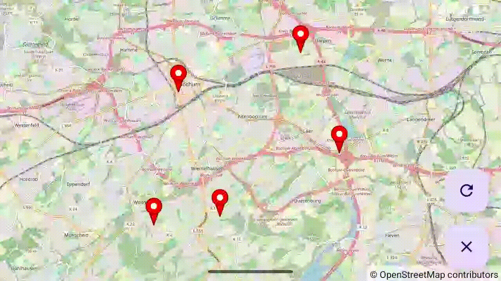

# Example07DraggableMarkers - Draggable Markers with Drag Events

[Back to README](../../README.md)

This example demonstrates draggable markers in OpenMapView, showing how to enable marker dragging and handle drag event callbacks.

## Features Demonstrated

- Draggable markers with long-press activation
- OnMarkerDragListener with start/drag/end callbacks
- Toast notifications showing drag events
- Add random markers with FAB button
- Clear all markers with FAB button
- Marker click listener alongside drag listener
- Attribution click listener for OSM copyright

## Screenshot



## Quick Start

### Option 1: Run in Android Studio

1. Open the OpenMapView project in Android Studio
2. Select `examples.Example07DraggableMarkers` from the run configuration dropdown
3. Click Run (green play button)
4. Deploy to your device or emulator

### Option 2: Build and Install from Command Line

```bash
# From project root - build, install, and launch
./gradlew :examples:Example07DraggableMarkers:installDebug

# Launch the app
adb shell am start -n de.afarber.openmapview.example07draggablemarkers/.MainActivity
```

## Code Highlights

### Creating Draggable Markers

```kotlin
val marker = Marker(
    position = LatLng(51.4661, 7.2491),
    title = "Marker 1",
    snippet = "Drag me!",
    draggable = true  // Enable dragging
)
mapView.addMarker(marker)
```

### Setting Up Drag Listener

```kotlin
mapView.setOnMarkerDragListener(object : OnMarkerDragListener {
    override fun onMarkerDragStart(marker: Marker) {
        Toast.makeText(context, "Started dragging: ${marker.title}", Toast.LENGTH_SHORT).show()
    }

    override fun onMarkerDrag(marker: Marker) {
        // Called continuously during drag - useful for real-time updates
    }

    override fun onMarkerDragEnd(marker: Marker) {
        val coordString = "%.4f, %.4f".format(
            marker.position.latitude,
            marker.position.longitude
        )
        Toast.makeText(context, "${marker.title} at: $coordString", Toast.LENGTH_SHORT).show()
    }
})
```

### Key Concepts

- **draggable = true**: Enable dragging on individual markers
- **OnMarkerDragListener**: Interface with three callbacks
- **onMarkerDragStart()**: Called when long-press initiates drag
- **onMarkerDrag()**: Called continuously during drag movement
- **onMarkerDragEnd()**: Called when finger is lifted
- **Marker position update**: Position is automatically updated during drag

## What to Test

1. **Add markers** - Click the refresh FAB to add 5 random draggable markers
2. **Long-press to drag** - Press and hold a marker, then drag it
3. **Observe start toast** - "Started dragging: Marker X" appears
4. **Observe end toast** - New coordinates shown when released
5. **Click markers** - Tap (don't hold) to see title and snippet
6. **Clear all** - Click the clear FAB to remove all markers
7. **Pan and zoom** - Markers remain draggable at all zoom levels
8. **Attribution click** - Tap OSM attribution to open copyright page

## Drag Interaction Details

### How Dragging Works

1. User long-presses on a draggable marker (~500ms)
2. `onMarkerDragStart()` is called
3. User moves finger while holding
4. `onMarkerDrag()` is called continuously
5. Marker visually follows the touch point
6. User lifts finger
7. `onMarkerDragEnd()` is called with final position

### Drag vs Click vs Pan

- **Click**: Quick tap on marker triggers click listener
- **Long-press on marker**: Initiates drag (if draggable)
- **Long-press on map**: Triggers map long-click listener
- **Drag on map**: Pans the map

## Technical Details

### Marker State During Drag

- Position is updated in real-time during drag
- Marker's visual position follows the touch point
- Final position is permanent after drag ends

### Performance

- Drag updates run on UI thread for responsiveness
- No coordinate conversion until drag ends (efficient)
- Smooth visual feedback during drag

## Advanced Usage

### Track Marker Movement

```kotlin
var startPosition: LatLng? = null

mapView.setOnMarkerDragListener(object : OnMarkerDragListener {
    override fun onMarkerDragStart(marker: Marker) {
        startPosition = marker.position
    }

    override fun onMarkerDrag(marker: Marker) {
        // Update UI with current position
    }

    override fun onMarkerDragEnd(marker: Marker) {
        val distance = calculateDistance(startPosition!!, marker.position)
        Toast.makeText(context, "Moved: ${distance}m", Toast.LENGTH_SHORT).show()
    }
})
```

### Combine with Click Listener

```kotlin
// Both listeners can coexist
mapView.setOnMarkerClickListener { marker ->
    Toast.makeText(context, marker.title, Toast.LENGTH_SHORT).show()
    true
}

mapView.setOnMarkerDragListener(object : OnMarkerDragListener {
    // ... drag callbacks
})
```

## Map Location

**Default Center:** Bochum, Germany (51.4661°N, 7.2491°E) at zoom 13.0

Random markers are generated within ~2.5km of the center.
