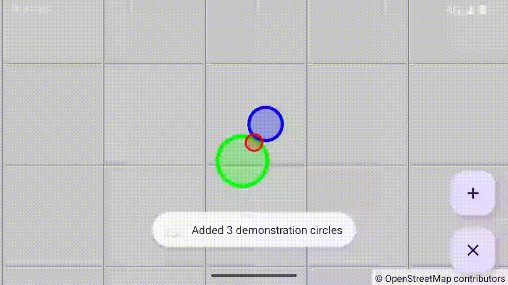

# Example08Circles - Circle Overlays with Meter-Based Radius

This example demonstrates the circle system in OpenMapView, including circle rendering with meter-based radius, styling options, z-index ordering, and both API patterns.

## Features Demonstrated

- Multiple circles with different radii (in meters)
- Both API styles: Kotlin direct instantiation and Google Maps builder pattern
- Circle styling (stroke color, fill color, stroke width)
- Z-index ordering for overlapping circles
- Circle click detection with hit testing
- Clickable circles with touch event handling
- Toast notifications showing circle properties
- FAB buttons for adding random circles and clearing all
- Meter-to-pixel conversion using Mercator projection

## Screenshot



## Quick Start

### Option 1: Run in Android Studio

1. Open the OpenMapView project in Android Studio
2. Select `examples.Example08Circles` from the run configuration dropdown
3. Click Run (green play button)
4. Deploy to your device or emulator

### Option 2: Build and Install from Command Line

```bash
# From project root - build, install, and launch
./gradlew :examples:Example08Circles:installDebug

# Launch the app
adb shell am start -n de.afarber.openmapview.example08circles/.MainActivity
```

## Code Highlights

### Adding Circles - Google Maps Style

```kotlin
// CircleOptions builder pattern (Google Maps compatible)
mapView.addCircle(
    CircleOptions()
        .center(LatLng(51.4661, 7.2491))
        .radius(500f)  // Radius in meters
        .strokeColor(Color.RED)
        .strokeWidth(5f)
        .fillColor(Color.argb(64, 255, 0, 0))
        .clickable(true)
        .zIndex(2f)
        .tag("Small Red Circle - 500m")
)
```

### Adding Circles - Kotlin Style

```kotlin
// Direct instantiation (Kotlin-idiomatic)
mapView.addCircle(
    Circle(
        center = LatLng(51.4661, 7.2491),
        radius = 750f,  // Radius in meters
        strokeColor = Color.MAGENTA,
        strokeWidth = 6f,
        fillColor = Color.argb(64, 255, 0, 255),
        clickable = true,
        zIndex = 1.5f,
        tag = "Kotlin Style Circle - 750m"
    )
)
```

### Circle Click Listener

```kotlin
setOnCircleClickListener { circle ->
    val tagStr = circle.tag?.toString() ?: "Unknown Circle"
    val coordStr = "%.4f, %.4f".format(
        circle.center.latitude,
        circle.center.longitude
    )
    Toast.makeText(
        context,
        "$tagStr\nCenter: $coordStr\nZ-Index: ${circle.zIndex}",
        Toast.LENGTH_SHORT
    ).show()
}
```

### Key Concepts

- **Circle**: Data class with center (LatLng), radius (meters), styling, and z-index
- **CircleOptions**: Fluent builder for Google Maps API compatibility
- **Radius in meters**: Real-world distances, converted to pixels via Mercator projection
- **addCircle()**: Accepts both Circle objects and CircleOptions builders
- **removeCircle()**: Remove a specific circle
- **clearCircles()**: Remove all circles
- **setOnCircleClickListener()**: Handle circle click events
- **Z-index ordering**: Controls draw order (higher = on top)

## What to Test

1. **Launch the app** - you should see 4 circles with different colors and sizes
2. **Click a circle** - Toast shows circle properties (tag, center, z-index)
3. **Observe z-ordering** - Small red circle (z=2) appears on top
4. **Click FAB (+)** - Adds a random circle with random radius and color
5. **Click FAB (×)** - Clears all circles
6. **Zoom in/out** - Circles scale correctly maintaining meter-based radius
7. **Pan the map** - Circles stay at correct geographic positions

## Circle Specifications

The demo includes 4 initial circles:

| Circle | Center Offset | Radius | Color   | Z-Index | Tag                        |
| ------ | ------------- | ------ | ------- | ------- | -------------------------- |
| 1      | (0, 0)        | 500m   | Red     | 2.0     | Small Red Circle - 500m    |
| 2      | (+0.01, +0.01)| 1000m  | Blue    | 1.0     | Medium Blue Circle - 1000m |
| 3      | (-0.01, -0.01)| 1500m  | Green   | 0.0     | Large Green Circle - 1500m |
| 4      | (+0.005, -0.015)| 750m | Magenta | 1.5   | Kotlin Style Circle - 750m |

**Z-Index Visual Order:** Green (bottom, z=0) → Blue (z=1) → Magenta (z=1.5) → Red (top, z=2)

## Technical Details

### Meter-to-Pixel Conversion

Circles use real-world meter-based radius, converted to screen pixels using the Mercator projection formula:

```kotlin
metersPerPixel = 156543.03392 * cos(latitude) / 2^zoom
radiusInPixels = radius / metersPerPixel
```

This ensures circles maintain accurate geographic size at all zoom levels.

### Circle Rendering Order

Circles are drawn in this order:
1. Polygons (filled shapes)
2. **Circles** (between polygons and polylines)
3. Polylines (line shapes)
4. Markers (on top)

Within the same shape type, z-index determines order (lower z-index drawn first).

### Touch Detection

Click detection uses distance calculation:
- Compute distance from touch point to circle center
- Hit if distance ≤ radius (in pixels) + strokeWidth/2
- Checks circles in reverse order (top to bottom) for correct z-ordering

## Styling Options

### Stroke Customization

```kotlin
CircleOptions()
    .strokeColor(Color.RED)      // Outline color
    .strokeWidth(10f)             // Outline width in pixels
```

### Fill Customization

```kotlin
CircleOptions()
    .fillColor(Color.argb(128, 255, 0, 0))  // Semi-transparent fill
```

### Alpha transparency in fill color allows overlapping circles to show through.

## Interactive Features

### Add Random Circles

The floating action button (+) adds random circles:
- Random center within ~1.5km of Bochum
- Random radius: 300-1500 meters
- Random color (RGB)
- Random stroke width: 3-12 pixels
- Random z-index: 0-5
- Clickable with auto-generated tag

### Clear All Circles

The floating action button (×) removes all circles from the map.

## Next Steps

- Try [Example03Markers](../Example03Markers) for marker overlays
- Try [Example04Polylines](../Example04Polylines) for polylines and polygons
- Try [Example06Clicks](../Example06Clicks) for map click listeners
- Modify circle radii to experiment with different sizes
- Try overlapping circles to see z-index ordering in action
- Add circles at your own locations

## Map Location

**Default Center:** Bochum, Germany (51.4661°N, 7.2491°E) at zoom 12.0

All circles are positioned around Bochum within ~2km radius.
