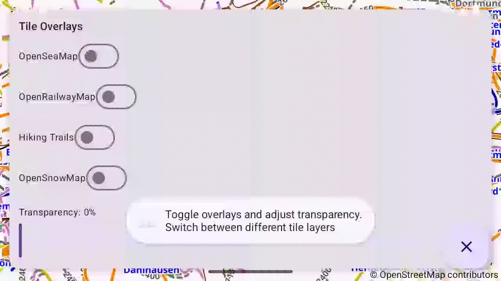

# Example09Overlays - Tile Overlay Layers from Public OSM Services

[Back to README](../../README.md)

This example demonstrates the tile overlay system in OpenMapView, showing how to add multiple tile layers on top of the base map from public OpenStreetMap services.

## Features Demonstrated

- Multiple tile overlays from public OSM services
- Predefined tile providers (OpenSeaMap, OpenRailwayMap, Waymarked Trails, OpenSnowMap)
- Z-index ordering for overlay layers
- Transparency control for overlays
- Dynamic overlay toggling (show/hide)
- Interactive Material3 control panel with Compose
- Real-time overlay property updates
- Overlay caching and tile downloading

## Screenshot



## Quick Start

### Option 1: Run in Android Studio

1. Open the OpenMapView project in Android Studio
2. Select `examples.Example09Overlays` from the run configuration dropdown
3. Click Run (green play button)
4. Deploy to your device or emulator

### Option 2: Build and Install from Command Line

```bash
# From project root - build, install, and launch
./gradlew :examples:Example09Overlays:installDebug

# Launch the app
adb shell am start -n de.afarber.openmapview.example09overlays/.MainActivity
```

## Code Highlights

### Adding Tile Overlays - Google Maps Style

```kotlin
// TileOverlayOptions builder pattern (Google Maps compatible)
val seaMapOverlay = TileOverlayOptions()
    .tileProvider(PredefinedTileProviders.openSeaMap())
    .transparency(0.0f)  // 0.0 = opaque, 1.0 = fully transparent
    .zIndex(1.0f)        // Higher values drawn on top
    .visible(true)

mapView.addTileOverlay(seaMapOverlay)
```

### Adding Tile Overlays - Kotlin Style

```kotlin
// Direct instantiation (Kotlin-idiomatic)
val railwayOverlay = TileOverlay(
    tileProvider = PredefinedTileProviders.openRailwayMap(),
    transparency = 0.0f,
    zIndex = 2.0f,
    visible = true
)

mapView.addTileOverlay(railwayOverlay)
```

### Using Predefined Tile Providers

```kotlin
// OpenSeaMap (nautical charts)
PredefinedTileProviders.openSeaMap()

// OpenRailwayMap (railway infrastructure)
PredefinedTileProviders.openRailwayMap()

// Waymarked Trails (hiking routes)
PredefinedTileProviders.waymarkedTrailsHiking()

// OpenSnowMap (ski pistes)
PredefinedTileProviders.openSnowMap()
```

### Custom URL Tile Provider

```kotlin
// Custom tile overlay from any URL template
val customProvider = PredefinedTileProviders.custom(
    "https://example.com/tiles/{z}/{x}/{y}.png"
)

val customOverlay = TileOverlayOptions()
    .tileProvider(customProvider)
    .zIndex(1.0f)
```

### Updating Overlay Properties

```kotlin
// Update transparency
val updatedOverlay = currentOverlay.copy(
    transparency = 0.5f  // 50% transparent
)
mapView.removeTileOverlay(currentOverlay)
mapView.addTileOverlay(updatedOverlay)
```

### Key Concepts

- **TileOverlay**: Data class with tileProvider, transparency, zIndex, and visibility
- **TileOverlayOptions**: Fluent builder for Google Maps API compatibility
- **TileProvider**: Interface for providing tiles (x, y, zoom)
- **UrlTileProvider**: Abstract class for URL-based tile sources
- **PredefinedTileProviders**: Factory for common OSM tile overlay services
- **Transparency**: 0.0 (opaque) to 1.0 (fully transparent)
- **Z-index ordering**: Negative (below base tiles) → 0 (base tiles) → Positive (above base tiles)

## What to Test

1. **Launch the app** - Base map loads with control panel at top
2. **Toggle OpenSeaMap** - Nautical charts appear (buoys, lighthouses, harbors)
3. **Toggle OpenRailwayMap** - Railway lines and stations appear
4. **Toggle Hiking Trails** - Hiking route markers appear
5. **Toggle OpenSnowMap** - Ski pistes and lifts appear
6. **Adjust transparency** - Use slider to change overlay opacity (0-100%)
7. **Enable multiple overlays** - Observe z-index ordering
8. **Clear all button** - FAB (×) removes all overlays
9. **Zoom in/out** - Tiles load dynamically at different zoom levels
10. **Pan the map** - Adjacent tiles prefetch for smooth panning

## Available Tile Overlays

| Overlay | Content | Attribution | License |
| ------- | ------- | ----------- | ------- |
| **OpenSeaMap** | Nautical charts, buoys, lighthouses, harbors, depth contours | Map data © OpenStreetMap contributors, Nautical data © OpenSeaMap | CC-BY-SA |
| **OpenRailwayMap** | Railway lines, stations, signals, electrification, speed limits | Map data © OpenStreetMap contributors, Railway data © OpenRailwayMap | CC-BY-SA |
| **Waymarked Trails (Hiking)** | Hiking trails with difficulty ratings and route information | Map data © OpenStreetMap contributors, Trail data © Waymarked Trails | CC-BY-SA |
| **OpenSnowMap** | Ski pistes, ski lifts, cable cars, winter sports facilities | Map data © OpenStreetMap contributors, Piste data © OpenSnowMap | Free |

See [docs/TILE_OVERLAYS.md](../../docs/TILE_OVERLAYS.md) for complete list of available overlays.

## Technical Details

### Tile Size and Projection

- **Tile Size**: 256×256 pixels (standard)
- **Projection**: Web Mercator (EPSG:3857)
- **Coordinate System**: XYZ tile scheme (z = zoom, x = column, y = row)
- **Zoom Levels**: Typically 0-18, some extend to 22

### Rendering Order

Layers are drawn in this z-index order:

```
Bottom (drawn first):
  - Tile overlays with negative z-index (custom base maps)
  - Base map tiles (z-index 0)
  - Tile overlays with positive z-index (typical overlays)
  - Polygons
  - Circles
  - Polylines
  - Markers
Top (drawn last)
```

### Transparency Control

Two levels of transparency:
1. **Tile-level**: PNG alpha channel in individual tiles
2. **Overlay-level**: `transparency` parameter (0.0 = opaque, 1.0 = fully transparent)

Combined using alpha blending during rendering.

### Tile Caching

- **Memory cache**: LRU cache for active tiles
- **Disk cache**: Persistent 50MB cache
- **Separate caches**: Each overlay has its own cache to avoid conflicts
- **Prefetching**: Adjacent tiles downloaded in background for smooth panning

### Performance Considerations

- Limit simultaneous overlays (2-3 maximum recommended)
- Each overlay multiplies network/memory usage
- Transparency reduces performance slightly
- Tile downloads run asynchronously in coroutines

## Overlay Properties

### Available Properties

```kotlin
data class TileOverlay(
    val tileProvider: TileProvider,     // Source for tile data
    val transparency: Float = 0f,       // 0.0 (opaque) to 1.0 (transparent)
    val zIndex: Float = 0f,             // Draw order (higher = on top)
    val visible: Boolean = true,        // Show/hide overlay
    val fadeIn: Boolean = false,        // Fade-in animation (future)
    val tag: Any? = null               // User data
)
```

### Z-Index Examples

```kotlin
// Below base tiles
TileOverlay(provider, zIndex = -1.0f)  // Custom base map

// Above base tiles (typical)
TileOverlay(provider, zIndex = 1.0f)   // OpenSeaMap
TileOverlay(provider, zIndex = 2.0f)   // OpenRailwayMap (on top)
```

## Attribution Requirements

All tile overlay services require attribution. OpenMapView automatically displays OSM attribution. For overlays, include appropriate attribution text:

- **OpenSeaMap**: "Nautical data © OpenSeaMap"
- **OpenRailwayMap**: "Railway data © OpenRailwayMap"
- **Waymarked Trails**: "Trail data © Waymarked Trails"
- **OpenSnowMap**: "Piste data © OpenSnowMap"

See each service's terms of service for detailed requirements.

## API Methods

### Adding Overlays

```kotlin
// Builder pattern
val overlay = mapView.addTileOverlay(TileOverlayOptions()...)

// Direct instantiation
val overlay = mapView.addTileOverlay(TileOverlay(...))
```

### Removing Overlays

```kotlin
// Remove specific overlay
mapView.removeTileOverlay(overlay)

// Remove all overlays
mapView.clearTileOverlays()
```

### Querying Overlays

```kotlin
// Get all overlays
val overlays = mapView.getTileOverlays()
```

## Interactive Features

### Control Panel

Material3 card with:
- **Toggle switches**: Enable/disable each overlay
- **Transparency slider**: Adjust opacity (0-100%)
- **Real-time updates**: Changes apply immediately

### Clear All Button

Floating action button (×) removes all overlays and resets transparency to 0%.

## Map Location

**Default Center:** Bochum, Germany (51.4661°N, 7.2491°E) at zoom 12.0

This location allows testing:
- **OpenSeaMap**: Not visible (inland city, no nautical features)
- **OpenRailwayMap**: Visible (major rail hub)
- **Hiking Trails**: Visible (trails nearby)
- **OpenSnowMap**: Limited visibility (some winter sports areas within zoom range)

Try panning to:
- **North Sea coast** (53.5°N, 7.2°E) for OpenSeaMap
- **Alps** (47.0°N, 11.0°E) for OpenSnowMap
- **Black Forest** (48.0°N, 8.0°E) for Hiking Trails

## Resources

- [Tile Overlays Documentation](../../docs/TILE_OVERLAYS.md)
- [OpenStreetMap Tile Servers](https://wiki.openstreetmap.org/wiki/Tile_servers)
- [OSM Tile Usage Policy](https://operations.osmfoundation.org/policies/tiles/)
