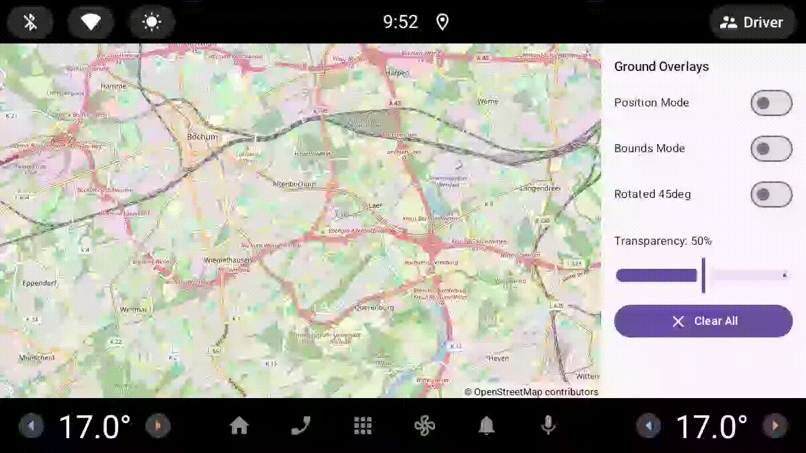

# Example10GroundOverlays - Ground Overlay Images on Map

[Back to README](../../README.md)

This example demonstrates ground overlays in OpenMapView, showing how to add images positioned on the map with support for rotation and transparency.

## Features Demonstrated

- Ground overlays with two positioning modes
- Position mode: Center point with width/height in meters
- Bounds mode: Stretch image to geographic bounds
- Bearing rotation (0-360 degrees)
- Transparency control (0-100%)
- Clickable ground overlays with listeners
- Z-index ordering for multiple overlays
- Dynamic overlay toggling (show/hide)
- Jetpack Compose UI with Material3

## Screenshot



## Quick Start

### Run in Android Studio

1. Open the OpenMapView project in Android Studio
2. Select `examples.Example10GroundOverlays` from the run configuration dropdown
3. Click Run
4. Deploy to your device or emulator

### Build from Command Line

```bash
./gradlew :examples:Example10GroundOverlays:assembleDebug
adb install examples/Example10GroundOverlays/build/outputs/apk/debug/Example10GroundOverlays-debug.apk
adb shell am start -n de.afarber.openmapview.example10groundoverlays/.MainActivity
```

## Code Highlights

### Position Mode

```kotlin
val groundOverlay = GroundOverlay(
    image = BitmapDescriptor.BitmapMarker(bitmap),
    position = LatLng(51.47, 7.25),
    width = 2000f,
    bearing = 0f,
    transparency = 0f,
    clickable = true,
    zIndex = 1f
)

mapView.addGroundOverlay(groundOverlay)
```

### Bounds Mode

```kotlin
val groundOverlay = GroundOverlay(
    image = BitmapDescriptor.BitmapMarker(bitmap),
    bounds = LatLngBounds(
        southwest = LatLng(51.46, 7.24),
        northeast = LatLng(51.47, 7.26)
    ),
    transparency = 0f,
    clickable = true,
    zIndex = 2f
)

mapView.addGroundOverlay(groundOverlay)
```

### Google Maps Style

```kotlin
val groundOverlay = mapView.addGroundOverlay(
    GroundOverlayOptions()
        .image(BitmapDescriptor.BitmapMarker(bitmap))
        .position(LatLng(51.465, 7.255), 1500f)
        .bearing(45f)
        .transparency(0f)
        .clickable(true)
        .zIndex(3f)
)
```

### Click Listener

```kotlin
mapView.setOnGroundOverlayClickListener { groundOverlay ->
    Toast.makeText(context, "Clicked: ${groundOverlay.tag}", Toast.LENGTH_SHORT).show()
}
```

### Update Properties

```kotlin
val updatedOverlay = currentOverlay.copy(
    transparency = 0.5f,
    bearing = 90f
)
mapView.removeGroundOverlay(currentOverlay)
mapView.addGroundOverlay(updatedOverlay)
```

## What to Test

1. **Toggle Position Mode** - Shows overlay centered at position with 2000m width
2. **Toggle Bounds Mode** - Shows overlay stretched to geographic bounds
3. **Toggle Rotated 45deg** - Shows overlay rotated 45 degrees clockwise
4. **Adjust Transparency** - Slider changes opacity (0-100%)
5. **Click Overlays** - Tap on overlay to see toast with tag
6. **Multiple Overlays** - Enable multiple overlays to see z-index ordering
7. **Clear All** - FAB button removes all overlays and resets transparency

## Key Concepts

- **Position Mode**: Center point + width (and optional height) in meters
- **Bounds Mode**: Geographic rectangle (LatLngBounds)
- **Bearing**: Rotation angle in degrees clockwise from north (0-360)
- **Anchor**: Rotation pivot point, default (0.5, 0.5) = center
- **Transparency**: 0.0 (opaque) to 1.0 (fully transparent)
- **Z-index**: Draw order (higher values drawn on top)
- **Clickable**: Whether overlay responds to touch events

## Use Cases

- Campus maps overlaid on street map
- Weather radar imagery
- Historic map comparisons
- Floor plans for indoor navigation
- Custom imagery layers

## Map Location

**Default Center:** Bochum, Germany (51.4661°N, 7.2491°E) at zoom 13.0

The example uses programmatically generated colored bitmaps with labels to demonstrate the different positioning and rotation modes clearly.

## API Compatibility

Ground overlays are Google Maps Android API compatible, supporting both positioning modes, rotation, transparency, and click handling.
