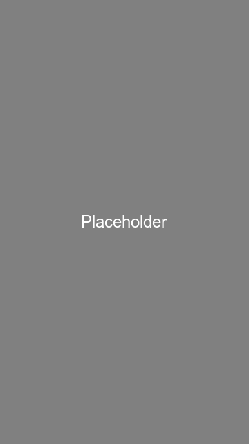

# Example11MapTypes

Demonstrates switching between different map types in OpenMapView.

## Features

- Switch between multiple map types:
  - **Normal** - Standard OpenStreetMap tiles
  - **Terrain** - OpenTopoMap with topographic contour lines
  - **Humanitarian** - Humanitarian OSM style (red/orange theme)
  - **Cycle** - CyclOSM with cycling infrastructure
  - **None** - No base map tiles
- Exception handling for unsupported types (Satellite/Hybrid)
- Dynamic attribution based on active tile source
- Material 3 UI with button controls

## Map Types

OpenMapView supports several free OpenStreetMap-based tile sources:

### Supported Types

| Type | Constant | Description |
|------|----------|-------------|
| Normal | `MapType.NORMAL` | Standard OpenStreetMap road map (default) |
| Terrain | `MapType.TERRAIN` | OpenTopoMap with elevation contour lines and hillshading |
| Humanitarian | `MapType.HUMANITARIAN` | Humanitarian OSM style emphasizing hospitals, schools, water sources |
| Cycle | `MapType.CYCLE` | CyclOSM showing bike lanes, paths, parking, and difficulty ratings |
| Topo | `MapType.TOPO` | Alias for TERRAIN |
| None | `MapType.NONE` | No base map tiles displayed |

### Unsupported Types

| Type | Constant | Reason |
|------|----------|--------|
| Satellite | `MapType.SATELLITE` | Requires paid satellite imagery API (Mapbox, Google, Bing) |
| Hybrid | `MapType.HYBRID` | Requires paid satellite imagery API |

Attempting to use unsupported types throws `UnsupportedOperationException` with a descriptive error message.

## Usage

```kotlin
val mapView = OpenMapView(context)

// Set map type
mapView.setMapType(MapType.TERRAIN)

// Get current map type
val currentType = mapView.getMapType()

// Handle unsupported types
try {
    mapView.setMapType(MapType.SATELLITE)
} catch (e: UnsupportedOperationException) {
    Toast.makeText(context, e.message, Toast.LENGTH_LONG).show()
}
```

## API Compatibility

OpenMapView implements the Google Maps Android API map type methods:

```kotlin
// Google Maps API
googleMap.setMapType(GoogleMap.MAP_TYPE_TERRAIN)
val type = googleMap.getMapType()

// OpenMapView (compatible)
openMapView.setMapType(MapType.TERRAIN)
val type = openMapView.getMapType()
```

## Screenshot



## Implementation Details

When the map type changes:
1. The tile source is updated in `MapController`
2. The tile cache is cleared to prevent showing incorrect tiles
3. Attribution text is updated to match the new tile source
4. The map view is invalidated to trigger a redraw

## Attribution

Different tile sources require different attribution text:

- **Standard OSM**: © OpenStreetMap contributors
- **Humanitarian**: © OpenStreetMap contributors
- **OpenTopoMap**: © OpenStreetMap contributors, SRTM | © OpenTopoMap (CC-BY-SA)
- **CyclOSM**: © OpenStreetMap contributors | © CyclOSM

Attribution is automatically displayed in the bottom-right corner and updates when the map type changes.
