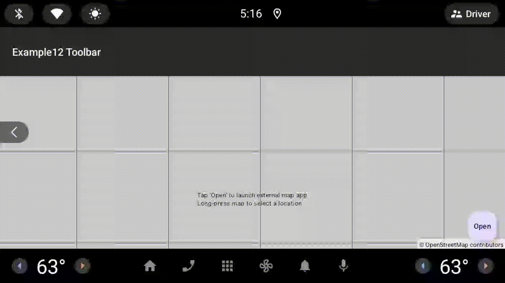

# Example12Toolbar - External Map App Integration

This example demonstrates how to open the current map location in external map applications using the `openInExternalApp()` method.

## Features

- Floating action button to open current location in external map apps
- Long-press gesture to select a location and open it in external apps
- Automatic fallback to OpenStreetMap.org if no map apps are installed
- Works with any installed map app (Google Maps, OsmAnd, Maps.me, HERE WeGo, Waze, Organic Maps, etc.)

## Usage

1. Tap the "Open" button to open the current map center in an external app
2. Long-press anywhere on the map to move to that location and open it in an external app

## How It Works

The app uses Android's geo: URI scheme to launch external map applications:

```kotlin
// Open current map center
mapView.openInExternalApp()

// Open with a custom label
mapView.openInExternalApp("Coffee Shop")

// Long-press to select and open
mapView.setOnMapLongClickListener { latLng ->
    mapView.moveCamera(CameraUpdateFactory.newLatLng(latLng))
    mapView.openInExternalApp("Selected Location")
}
```

## Behavior

- If user has one map app installed, it opens directly
- If user has multiple map apps, Android shows an app picker
- If user has no map apps, falls back to opening OpenStreetMap.org in browser

## Screenshot



## Documentation

For more details, see [MAP_TOOLBAR.md](../../docs/MAP_TOOLBAR.md)
